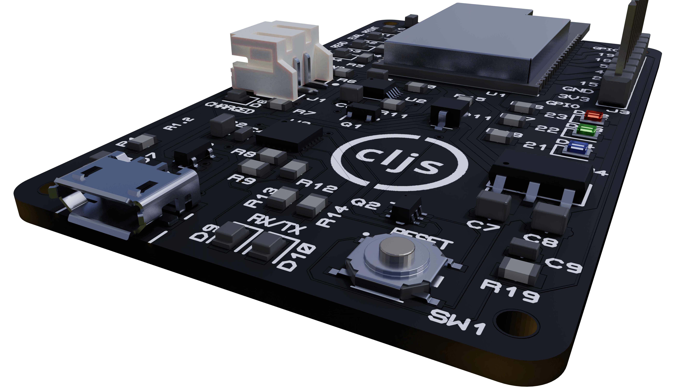

# esprit-board

This repository contains the [schematics](esprit-board.PDF), BOM ([CSV](Bill%20Of%20Materials%20Esprit.csv), [PDF](Bill%20Of%20Materials%20Esprit.pdf)), [Gerber files](esprit-board%20-%20CADCAM.ZIP), and [Proteus project](esprit-board.pdsprj) for a ESP32-based board capaple of running ClojureScript. These boards are designed to be used with the [Esprit REPL](https://github.com/mfikes/esprit).

> Note: You don't need to use this particilar board to run ClojureScript. Any ESP32 WROVER with 8 MiB SPIRAM is capable of running a ClojureScript REPL. 

The files in this repository are open source. Feel free to use them to understand how things work, use the Gerbers and BOM make your own boards, etc.

 If you'd like to buy one pre-assembled they are [available on Tindie](https://www.tindie.com/products/fikesfarm/esprit-clojurescript-repl/).

## USB

The board uses a Silicon Labs CP2102N USB to UART chip. If needed, the drivers for various OSs are available [here](https://www.silabs.com/products/development-tools/software/usb-to-uart-bridge-vcp-drivers).

The board comes with a micro-USB connector.

## Power / Batteries

The board has circuitry that allows it to run either from power obtained from the micro-USB connetion or from power supplied by a lithium ion polymer ("lipo
") battery. You can dynamically switch between the two and the ESP32 will continue to run uninterrupted so long as either is connected.

If you have both USB and a battery connected, the board has an onboard IC (an MCP73833T) that is used to properly charge the lipo battery. In short, it behaves much like a modern cellphone.

Here are batteries that have been successfully used with the board:

- [Adafruit 100 mAh](https://www.adafruit.com/product/1570)
- [Adafruit 1200 mAh](https://www.adafruit.com/product/258)
- [Adafruit 2400 mAh](https://www.adafruit.com/product/328)
